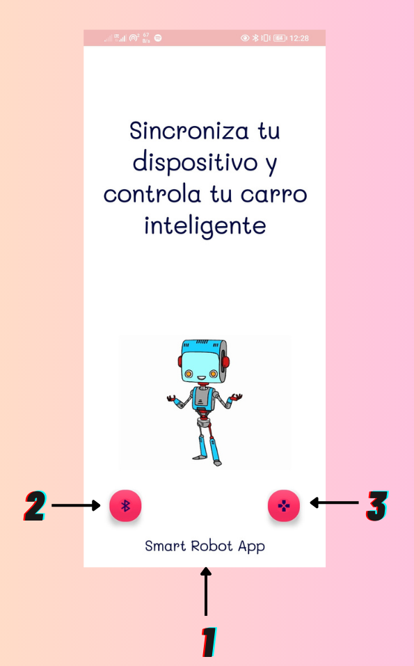
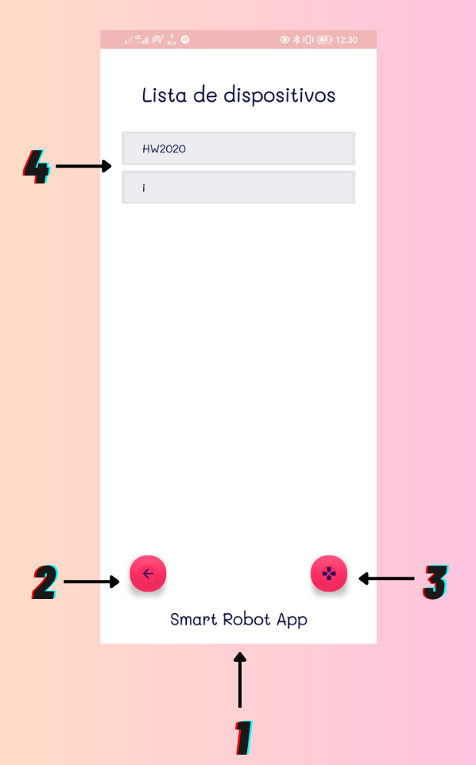
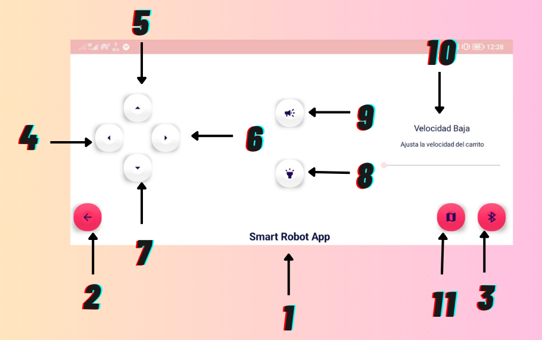
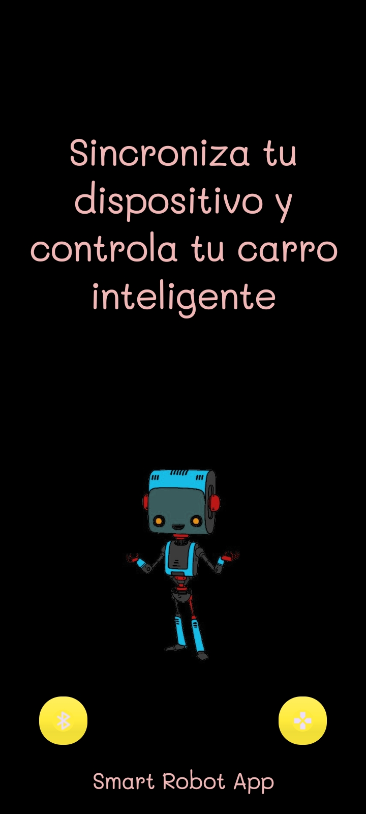
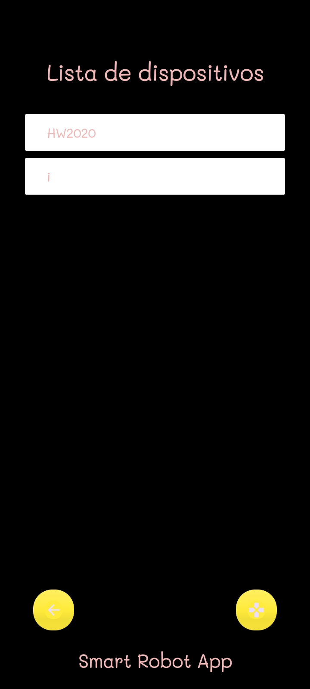
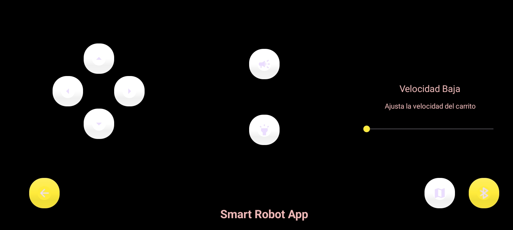
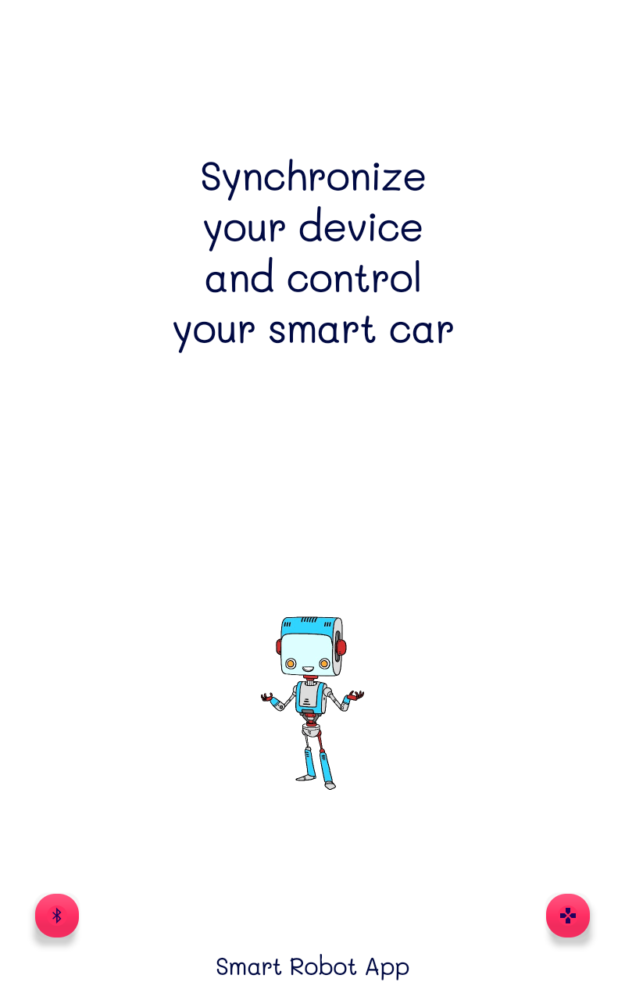
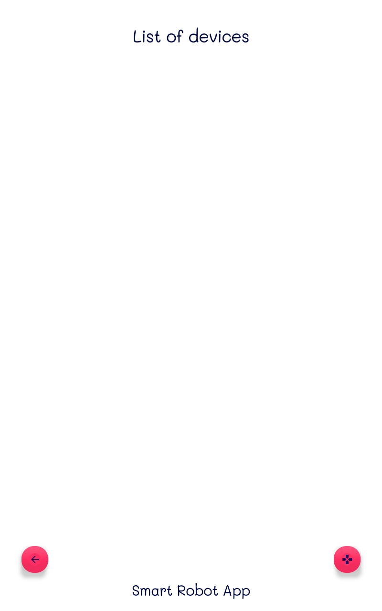
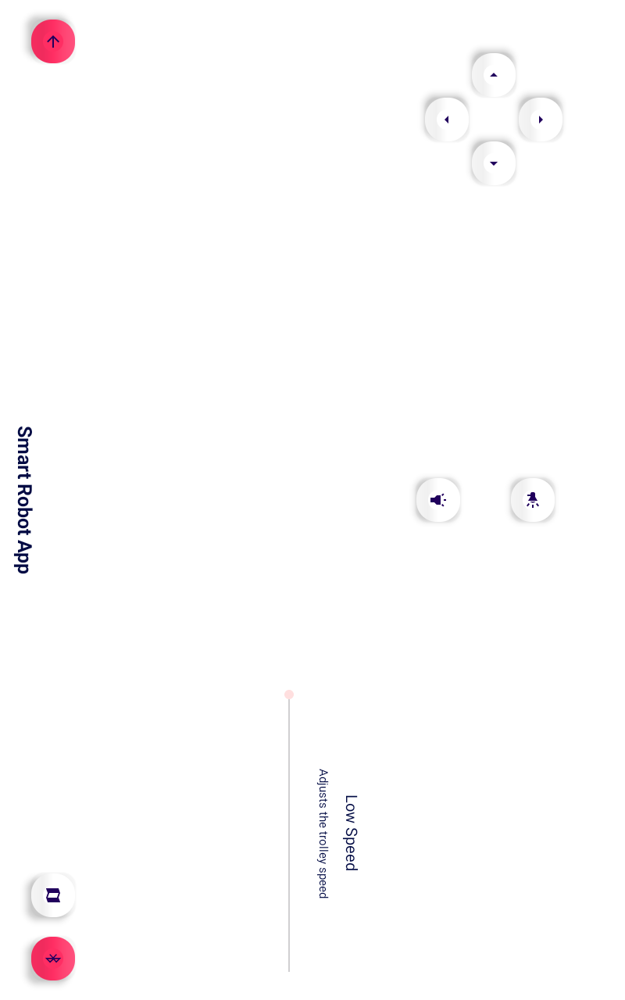

# SmartRobotApp 

#### Steps

* Give permission to the app to turn on bluetooth
* Having previously linked the phone or tablet to the module
* Click on the name of the previously linked bluetooth module
* Head over to controls and drive your arduino car

### Welcome 

1. Name app
2. Button to bluetooth
3. Button to controllers

### Bluetooth

1. Name app
2. Button to back
3. Button to controllers
4. List of devices

### Controllers 

1. Name app
2. Button to back
3. Button to bluetooth
4. Left button
5. Forward button
6. Rigth button
7. Back button
8. Lights button
9. Horn button
10. Speed bar
11. Route button

## Nigth mode

### Welcome 

### Bluetooth

### Controllers 

## Tablet design

### Welcome 

### Bluetooth

### Controllers 

repository link [https://github.com/firefoxOsUca2023/SmartRobotApp.git].
